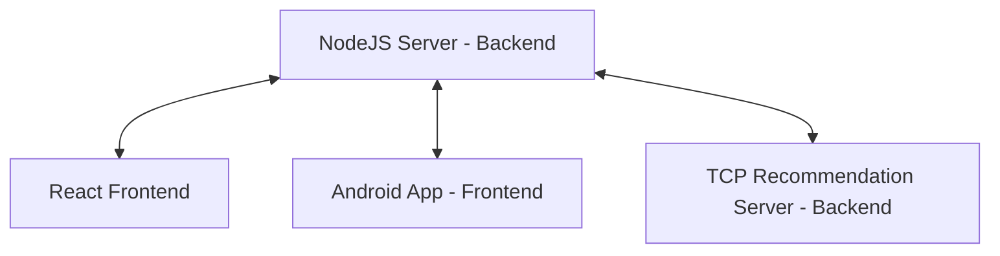
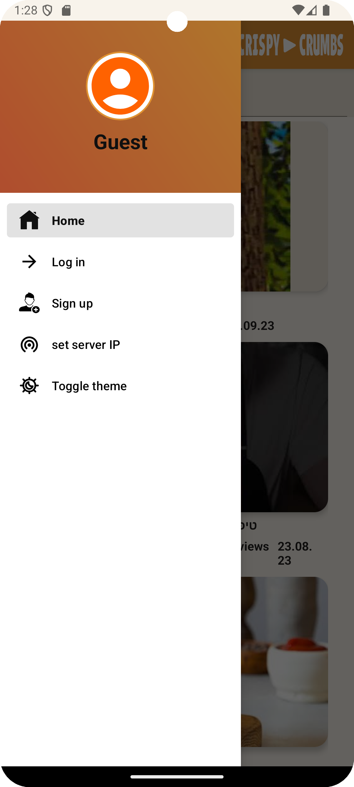
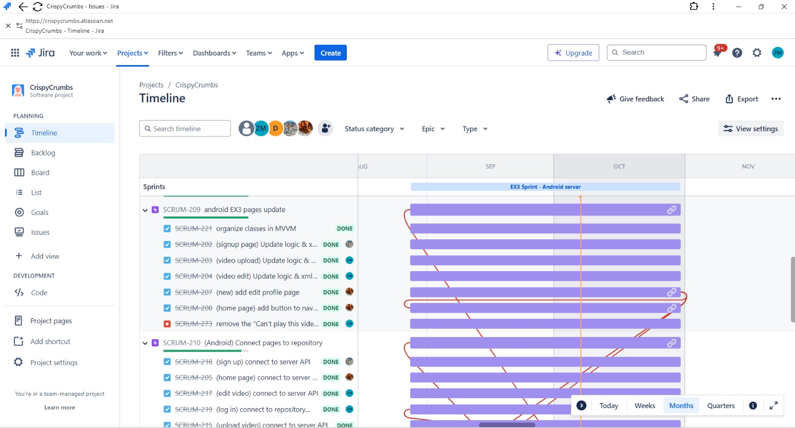

# Crispy Crumbs - Android App

Welcome to the **Crispy Crumbs** app, a dedicated video-sharing platform showcasing only the finest Crispy Crumbs content. This app is built using Android Studio to ensure a smooth, interactive, and enjoyable user experience.

## Crispy Crumbs - Founders

- Ofek Avan Danan (211824727)
- Zohar Mzhen (314621806)
- Dolev Menajem (207272220)

## Running the Crispy Crumbs App

### Prerequisites

The app is designed to run on Android devices with **Android 10** and above. You will need **Android Studio Jellyfish (2023.3.1)** or later to open the project and run the app.

Before running the Crispy Crumbs app, you need to set up and start the backend server:

- Follow the instructions in the [CrispyCrumbsServer repository](https://github.com/Mzhenian/CrispyCrumbsServer) to set up and run the server.
- **Don't forget the TCP Server!** It's necessary for video recommendations. Activate the [C++ TCP Server](https://github.com/Mzhenian/CrispyCrumbsTCP) as instructed in its repository.



### Connecting to Your Android Device

You have two main ways to run the app on a compatible Android device:

- **Install the APK**: Download the APK from the releases section and run the app.
- **Use Android Studio**: Download the entire project, open it in Android Studio, and connect your device via USB or Wi-Fi. Make sure ADB debugging is enabled in developer options. Then, select the "app" run/debug configuration and click run.

Once the server is running, follow these steps to connect your Android device:

1. Ensure that **both your Android device and the computer running the server** are connected to the same network. **Note:** This network should be open and not restricted to allow communication between the app and the server.

2. Open the Crispy Crumbs app on your Android device.

3. Open the Crispy Crumbs menu by clicking on the **three-line button** (also known as the "crispy chicken" menu).

4. Select the **Set Server IP** option.

5. Enter the **IP address** of the computer where the server is running.

#### Finding Your Computer's IP Address

##### On Windows:

1. Open the **Command Prompt** by pressing `Windows Key + R`, typing `cmd`, and pressing Enter.
2. In the Command Prompt, type the following command and press Enter:
   ```
   ipconfig
   ```
3. Look for the section called **Wireless LAN adapter Wi-Fi** or **Ethernet adapter**. The **IPv4 Address** listed there is your computer's IP address (e.g., `192.168.1.100`).

##### On Linux:

1. Open a terminal.
2. Type the following command and press Enter:
   ```
   hostname -I
   ```

##### On macOS:

1. Open the **Terminal**. You can find it by searching for "Terminal" in Spotlight (`Command + Space`).
2. In the terminal, type the following command and press Enter:
   ```
   ifconfig
   ```

6. Once you have the IP address, enter it in the app's **Set Server IP** field, and the app will connect to the server.




### Running the App on an Android Emulator

If you are using an Android emulator:

1. Download the [entire project](https://github.com/Mzhenian/CrispyCrumbsAndroid.git) and open it in Android Studio.
2. Add a virtual device using the device manager in Android Studio.
3. Make sure that the emulator and the machine running the server are on the same network.
4. Follow the steps above to set the server's IP address in the app.

Now, you can run the app and enjoy the Crispy Crumbs experience!

## App Pages Overview

Now you’re all set to enjoy the full Crispy Crumbs experience! Dive into a world of video goodness, just like biting into a perfectly crispy schnitzel — crunchy on the outside, packed with flavor on the inside.

### 0. Navigation Menu

The app features a navigation menu accessible via the three-line button at the top. The options in the menu vary depending on whether a user is logged in. Logged-in users can log out, upload videos, edit them, or view their uploaded videos.

### 1. Homepage

The homepage features a search bar at the top and a list of videos with titles, thumbnails, uploader names, views, and upload dates.

### 2. Sign Up

This page allows new users to sign up with details such as username, email, password, and optional profile information like birthday and phone number.

### 3. Login

This page includes fields for username and password. For a quick demo, use:
- **Username**: "Tuna", **Password**: "password6"
- **Username**: "ArnoldSchwarzenegger", **Password**: "password8"

### 4. Video Upload

Users can upload a video with details like title, description, and a thumbnail.

### 5. Video Edit

Users can edit the video title, description, and thumbnail, or delete the video.

### 6. Video Player

This page includes a video player, video details, and interactive options like like/dislike buttons and comments. Logged-in users can edit or delete their own comments.

### 7. Profile Page

This page allows users to view their profile details, including their uploaded videos. Users can also view other users' profiles by clicking on their usernames from video pages, allowing them to follow and explore more content.

### 8. Dark Theme

The app includes a dark mode that can be toggled from the navigation menu.

## Work Process

Our project was a collaborative effort. We initially met to plan and divided tasks using Jira. We designed mockups with Figma and then began coding the app. The journey was both educational and enjoyable.

- **Jira Board**:  
  [Jira Missions](https://crispycrumbs.atlassian.net/jira/software/projects/SCRUM/list?sortBy=customfield_10020&direction=ASC)
  

