Note: We have submitted the final version of part 1 of the project late to enable Dolev, who's in active reserve service those days, to participate in the full project. And we received approval in person and by email.

 # Crispy Crumbs - Android App

 Welcome to the Crispy Crumbs app, a dedicated video-sharing platform showcasing only the finest Crispy Crumbs content. This app is built with Android Studio to ensure a smooth, interactive, and tasty user experience.

### Crispy Crumbs - founders
Ofek Avan Danan 211824727
Zohar Mzhen 314621806
Dolev Menajem 207272220

## Running the Crispy Crumbs App
The app is built for Android versions 10 up to 14 and is designed to run on Android devices as well as on emulators.
Getting the Crispy Crumbs app to work on your device is simple and straightforward:

1. ### 'Personal Android Device' :
   There are two crispy-golden ways to run the app on a compatible Android device.
   First: Install the APK from  the [releases section of the GitHub page](https://github.com/Mzhenian/CrispyCrumbsAndroid/releases/tag/v1) and run the app. 
   Second: Download the entire project and open it in Android Studio - add your personal (physical) Android device to the studio devices by either connecting it with a USB to your machine, or through wi-fi. (Note that this method requires enabling ADB debugging through the developer options in the device.) - ensure you are on the "app" run/debug configuration and press the run button to launch the home page of CrispyCrumbs.
2. ### 'Emulator' :
   Download the [entire project](https://github.com/Mzhenian/CrispyCrumbsAndroid.git) and open the project in Android Studio - add a virtual device emulator to your liking through the device manager on the right toolbar of Android Studio, and run the app on the emulator.

   At any stage you can travel through the app using the navigation side menu, which adapts to the user's login status and shows only the relevant options.

## App Pages
0. ### Navigation Menu

   The app features an omnipresent, all-powerful navigation menu you can open with a click of the three-line button at the corner of the top bar.
   The navigation bar will show different options whether a user is logged in or not, specifically, if there are no logged users it will show the option to log in and sign up, and if a user is logged
   it will show the option to logout or go to the video upload page, video edit page, or your uploaded videos list page.
    
    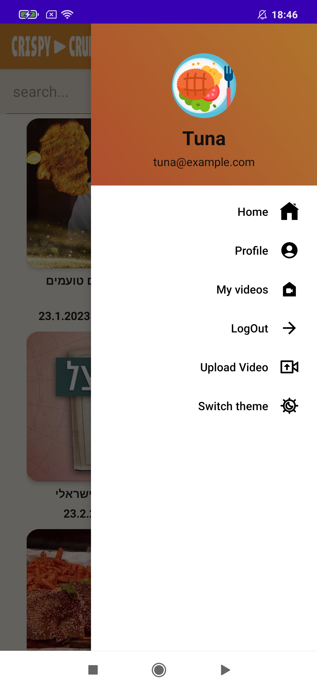
    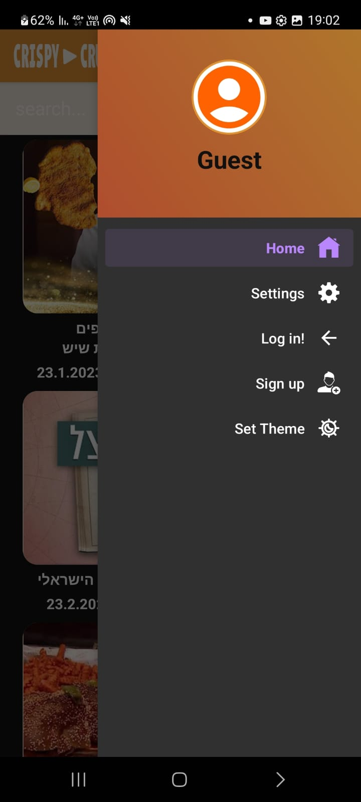

1. ### Homepage
  
    The homepage of the Crispy Crumbs app features a search bar at the top, and a list of available videos, each presented with its title, thumbnail, uploader, views count and upload date.

   

   Additionally we implemented a personal video list, from which a user can edit his videos to his liking. 
   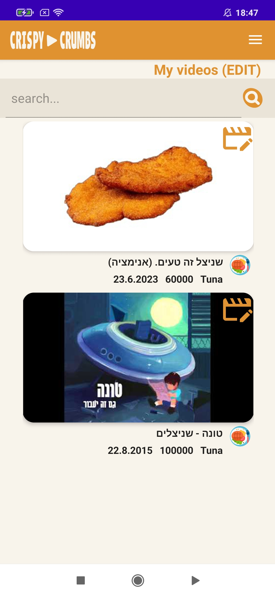

2. ### Sign Up
  
   It includes the crucial fields of email address, username, password and displayed name (to mask the username) with the optional birthday and phone number and the option to upload a profile picture. 
   The form includes a "Sign up" (which validates the entered data before creating a user node from them) and a "Log In" button, in case you already have an account.

   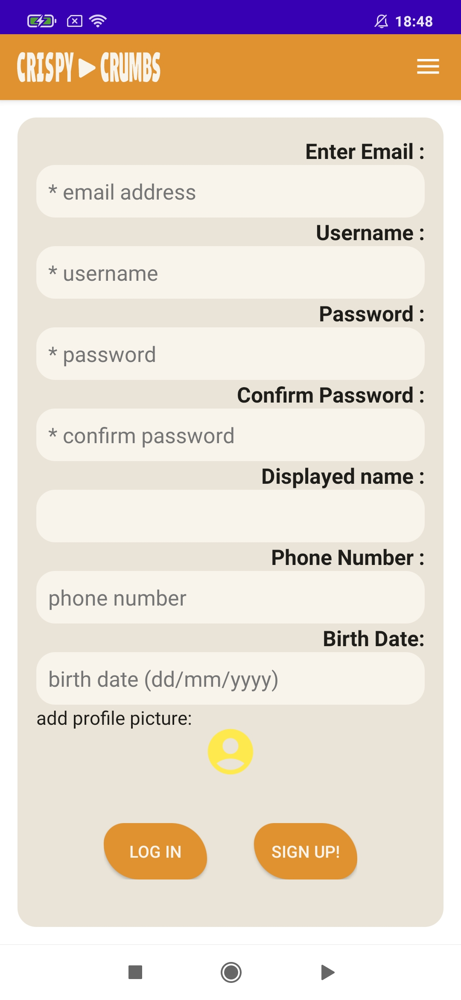

3. ### Login

   It includes fields for entering the username and password. For the demo, you can log in with Username: "Tuna" Password: "password6" or Username: "ArnoldSchwarzenegger" Password: "password8".

   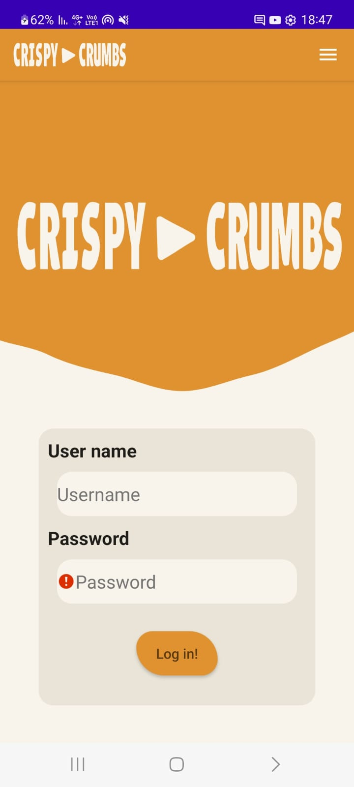

5. ### Video Upload

   Includes fields for uploading a video file with complementary date - the video title, description and thumbnail. when they are valid you can press the "Upload" button or the "Cancel" button at any time.

   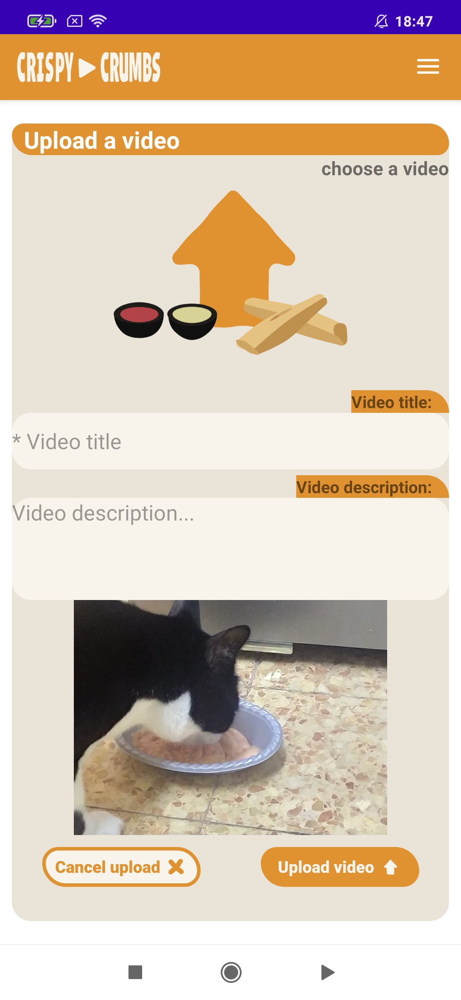

6. ### Video Edit

   Allows the user to edit the video's title, description and thumbnail or delete the video completely.

   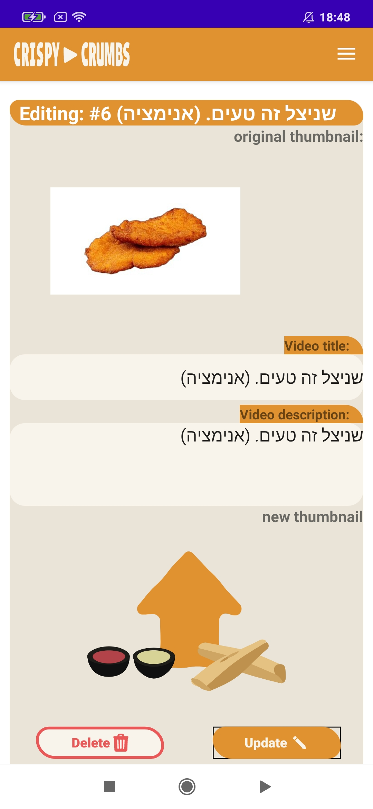

7. ### Video Player

   This page shows a video player at the top. Below it, there are details about the video, including the uploader's name, upload date and views. Logged-in users can interact with the video with the like/unlike buttons and the comments section below which allows them to delete and edit their own comments.
    There is also a share button to open a "stupid" share menu.

   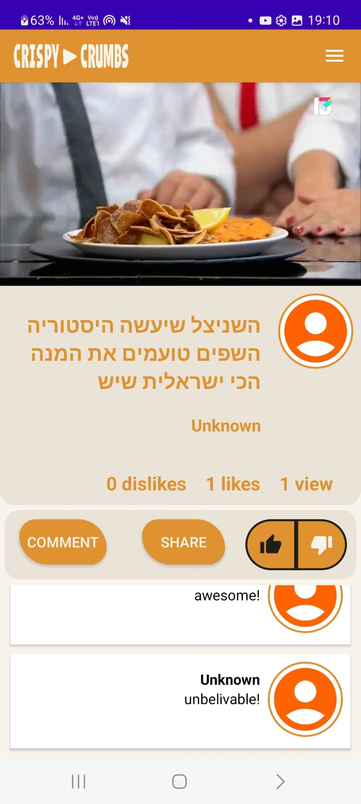

7. ### Dark Theme

   The app features a dark mode that can be toggled on and off from the navigation menu, independently from the system dark theme. The dark theme changes the color scheme of the app to a darker, more eye-friendly palette.

    
   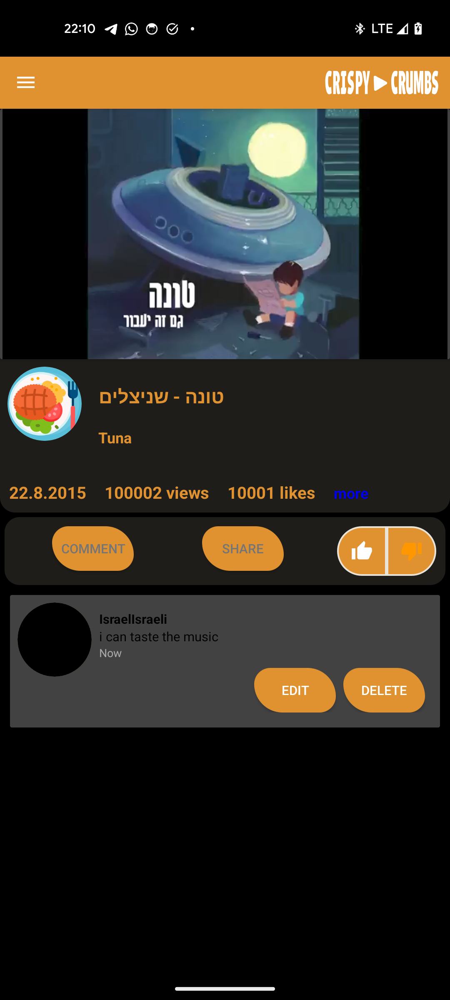 
   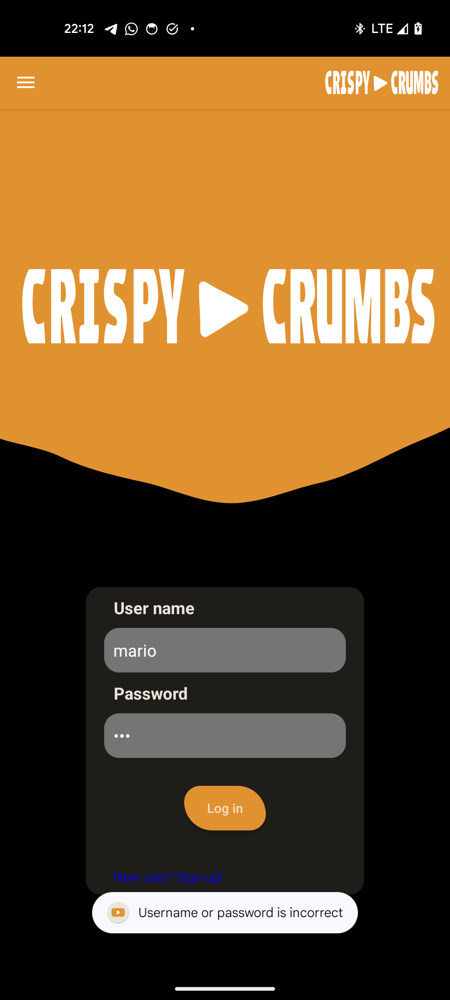 
    

## Work process -  
Our project was built collaboratively as a team. 
Initially, we met to plan the work together using Jira to divide the tasks among us and keep track of the progress. 

We created mockups for the website and application pages using Figma, and then we started working on the code for both the application and the website. The process was educational, and we thoroughly enjoyed the journey.
the Jira page -
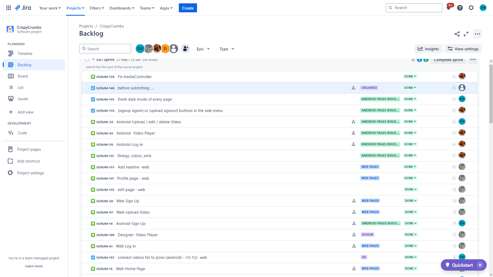

The Figma document-
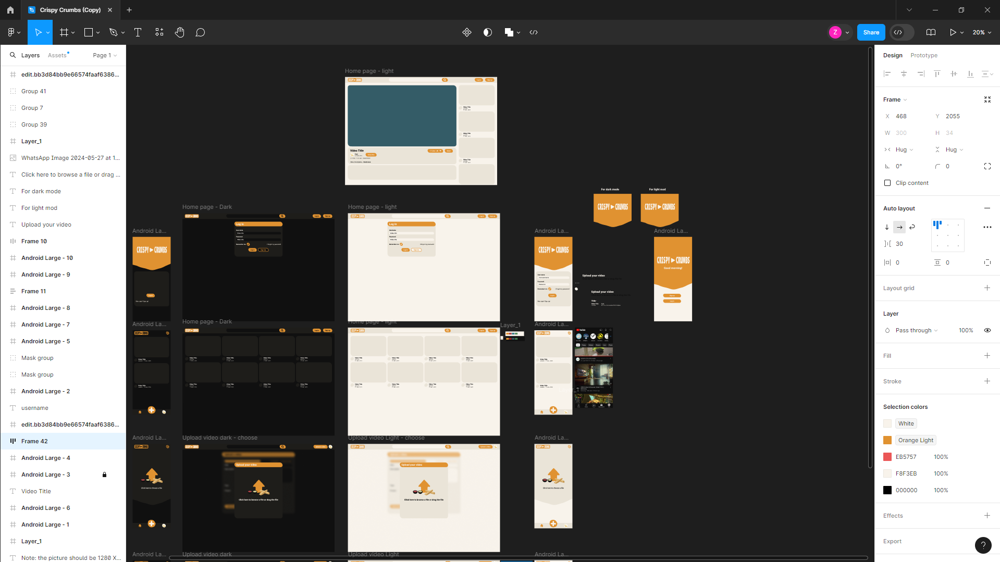

